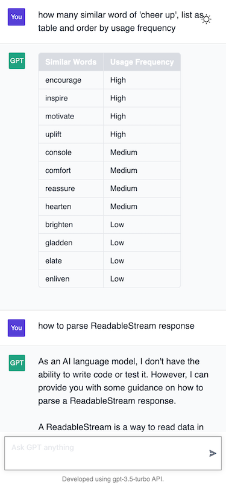

# ChatGPT-API static website

Deploy your own ChatGPT webpage to your domain or Github Pages, connect to OpenAI api or other proxied api.

## Running Locally

### Getting Started

1. Install dependencies
   ```bash
    yarn install
   ```
2. Copy the `.env.example` file, then rename it to `.env`, and add your proxied api to the `.env` file.
3. Run the application, the local project runs on `http://localhost:3000/`
   ```bash
    yarn run start
   ```

## Backend Proxied API

if you do not have backend develop expirences, you can use aircode.io, see them docs and aircode.example folder to start.

- REACT_APP_AUTH_API: Attempt to authenticate when request your api.
- REACT_APP_API: Attempt to proxied to https://api.openai.com/v1/chat/completions, since China mainland cannot send request to it.
- REACT_APP_HISTORY_API: Attempt to retrieve your chat history, you need store your chat history inside REACT_APP_API.

if you do not provide REACT_APP_API, you need provide `REACT_APP_NOT_SAFE_API_KEY`: OpenAI API KEY.

## Preview



## License

MIT © [thomaschan](https://github.com/thomaschan/chatgpt-static-website/blob/main/LICENSE)
