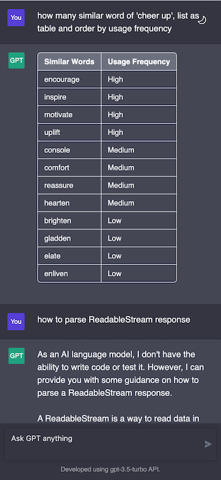

# ChatGPT-API static website

Deploy your own ChatGPT webpage to your domain or Github Pages, connect to OpenAI api or other proxied api.

## Running Locally

### Getting Started

1. Install dependencies
   ```bash
    yarn install
   ```
2. Copy the `.env.example` file, then rename it to `.env`, and add your proxied api to the `.env` file.
3. Run the application, the local project runs on `http://localhost:3000/`
   ```bash
    yarn run start
   ```

## Preview



## License

MIT © [thomaschan](https://github.com/thomaschan/chatgpt-static-website/blob/main/LICENSE)
